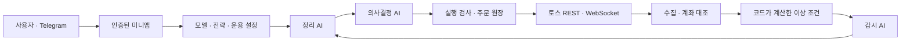

# 구조

L5PHA는 단일 소유자의 AWS에서 실행되는 국내 주식 투자 애플리케이션입니다. Telegram 미니앱은 해당 AWS의 HTTPS 화면을 엽니다.

- 감시는 코드가 선별한 이벤트를 검토하고 필요한 증거를 저장합니다. 긴급 판단도 정리 결과를 거쳐 최종 판단 진행 여부를 결정합니다.
- 정리는 후보와 증거를 압축합니다. 의사결정 직전에 계좌·시세·미체결을 갱신하고 필요한 추가 정보는 읽기 전용 도구로 조회합니다.
- AI는 증권사 주문 도구나 DB·SQL 도구를 직접 받지 않습니다. 원시 데이터 전량을 계층마다 전달하지 않습니다.
- 의사결정은 요약·상세 설명·제안을 기록하고 메모리북에 이어질 근거를 남깁니다. 사용자가 활성화한 경우 실행기가 계좌·조건을 검사해 주문하며 불확실한 제출은 대조 전까지 신규 판단을 막습니다.
- AWS 서버 안에서도 관리·분석·수집·제공자 연결 프로세스의 사용자와 파일 접근을 나눕니다. 분석 모델 호출은 제한한 Lambda 경로를 사용합니다.
- OpenAI·Gemini API는 자체 검색을, 추가 구성된 Bedrock은 AgentCore 검색을 이용합니다. 공용 봇에는 계좌 중계나 주문 처리가 없습니다.

## 설치·소유권

브라우저가 일회 연결 코드를 생성하고 AWS에는 그 해시만 전달합니다. Telegram 서명과 코드 검증을 통과한 한 명의 사용자가 소유자가 됩니다. 후속 요청은 서버 세션·Origin·CSRF 검사를 거칩니다. 초기 토스 연결은 인증된 소유자만 가능한 Unix 소켓 경로를 통해 사용자의 암호화 저장소에 보관합니다.

## 운영 경계

로그아웃과 앱 닫기는 서버 중단이 아닙니다. AWS 비용 한도 도달·서버 장애 시 감시와 주문 관리가 멈출 수 있습니다. AWS 정지·삭제가 토스에 접수된 주문을 취소하는 것은 아닙니다. 모든 운용 설정과 비용 한도는 역할에 맞게 따로 관리해야 합니다.
